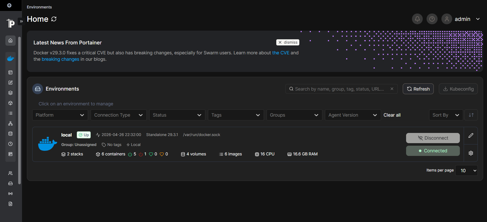
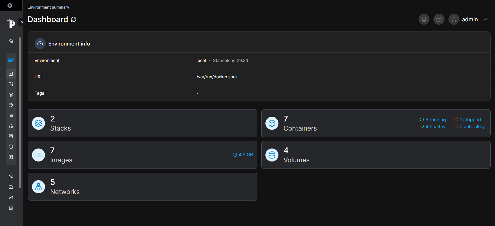
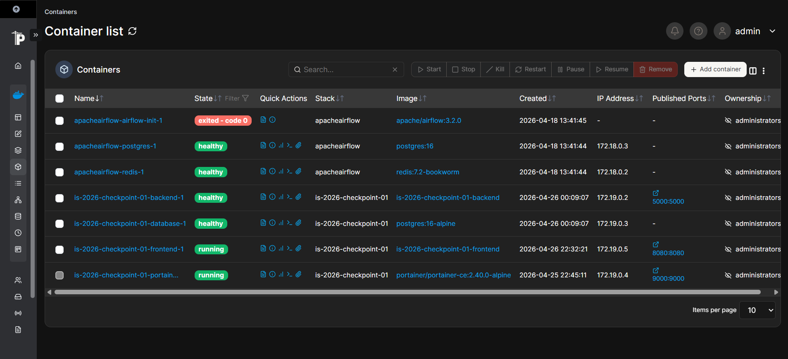

# TeamBoard App

## Integrantes del equipo

| Nombre                          | Legajo | Feature    | Servicio                       |
| ------------------------------- | ------ | ---------- | ------------------------------ |
| Moyano Amaya, Pedro             | 31411  | Feature 01 | Coordinación e Infraestructura |
| Reale Bortone, Milagros Ailen   | 32856  | Feature 02 | Frontend                       |
| Jiménez, Franco                 | 31848  | Feature 03 | Backend                        |
| Portillo Colinas, Franco Javier | 31089  | Feature 04 | Base de Datos                  |
| Calvo, Bautista                 | 32156  | Feature 05 | Panel Portainer                |

Stack

- Frontend: HTML, JavaScript y CSS estáticos, servidos con `http.server` de Python.
- Backend: Flask sobre Gunicorn, Python 3.12.
- Base de datos: PostgreSQL 16 (Alpine).
- Orquestación: Docker Compose.
- Administración: Portainer CE.

Requisitos

- Docker 24 o superior.
- Docker Compose v2.
- Puertos libres en el host: 5000, 8080 y 9000.
  Configuración
  Las credenciales de Postgres se leen desde un archivo `.env` en la raíz del repositorio. 
  Ese archivo no se versiona. Antes del primer arranque, crearlo con el siguiente contenido:

```env
POSTGRES_HOST=database
POSTGRES_PORT=5432
POSTGRES_DB=teamboard
POSTGRES_USER=teamboard
POSTGRES_PASSWORD=cambiar
```

`POSTGRES_HOST=database` apunta al nombre del servicio definido en `docker-compose.yml`, no al hostname del equipo donde se ejecuta Docker.
Levantar el entorno

```sh
docker compose up -d --build
```

Nos fijamos que el contenedor este levantado mediante

```sh
docker compose ps
```

y luego acceder por el siguiente link: http://localhost:9000

Se adjuntan capturas del funcionamiento de Portainer:




